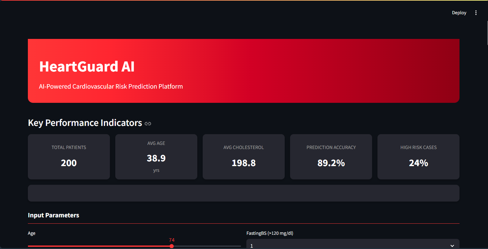

# ❤️ HeartGuard AI – Cardiovascular Risk Prediction Platform  

**HeartGuard AI** is an end-to-end **Machine Learning + Streamlit Web App** designed to predict heart disease risk using clinical data.  
It combines robust ML models with an interactive, user-friendly dashboard to make AI in healthcare **accessible, interpretable, and actionable**.  

## 🚀 Features  

### 🔢 Machine Learning Workflow
- **Data Preprocessing** → Encoding categorical features, scaling numerical values, handling splits  
- **Model Training & Tuning** → Logistic Regression, Random Forest, XGBoost, CatBoost  
- **Evaluation Metrics** → Accuracy, Precision, Recall, F1-score, ROC-AUC  
- **Final Model** → Tuned XGBoost achieving **~90% accuracy** and **93% ROC-AUC**  

### 🌐 Interactive Streamlit Web App
- **Dynamic KPI Cards** → Display accuracy, average patient age, cholesterol levels, and high-risk cases  
- **Central Prediction Panel** → Shows *High Risk ❤️* / *Low Risk 💚* results with probability scores in real-time  
- **Gauge Visualization** → Heart disease risk meter with severity levels  
- **Multi-Tab Analytics**  
  - Risk Analysis (feature importance for each prediction)  
  - Feature Analysis (global importance + scatter plots)  
  - Model Performance (metrics + ROC curve)  
  - Data Explorer (preview, histograms, statistics)  
- **Human-Readable Clinical Summary** → Translates numeric inputs into real-world terms (Male/Female, Angina: Yes/No)  
- **Downloadable Data** → Explore and export dataset insights as CSV  

## 📂 Project Structure  
📁 Heart-Guard-AI
├── heart.csv # Dataset (UCI Heart Disease Dataset)
├── app.py # Main Streamlit application
└── README.md # Project documentation

## 📊 Dataset

This project uses the UCI Heart Disease Dataset
 containing demographic and clinical features such as:

Age, Sex, Chest Pain Type, RestingBP, Cholesterol, MaxHR, Exercise Angina, Oldpeak, ST Slope

Target variable: HeartDisease (0 = No, 1 = Yes)

# 🖼️ Screenshots — HeartGuard AI

## 📊 Dashboard Overview

## ❤️ Prediction Example

## Input Features

## ⚠️ Disclaimer

This tool is built for educational and informational purposes only.
It is not a medical diagnostic tool and should not replace professional medical advice.

📌 Tech Stack

Python, Pandas, NumPy, Scikit-learn, XGBoost, CatBoost

Streamlit (for UI & interactivity)

Plotly / Matplotlib (for visualizations)

## ⚙️ Installation & Usage  

1. Clone the repository:  
   git clone https://github.com/Wariha-Asim/Heart-Guard-AI.git
   cd heartfailure.py
   
2. Run the Streamlit app:
streamlit run app.py
Open in your browser at http://localhost:8501/

